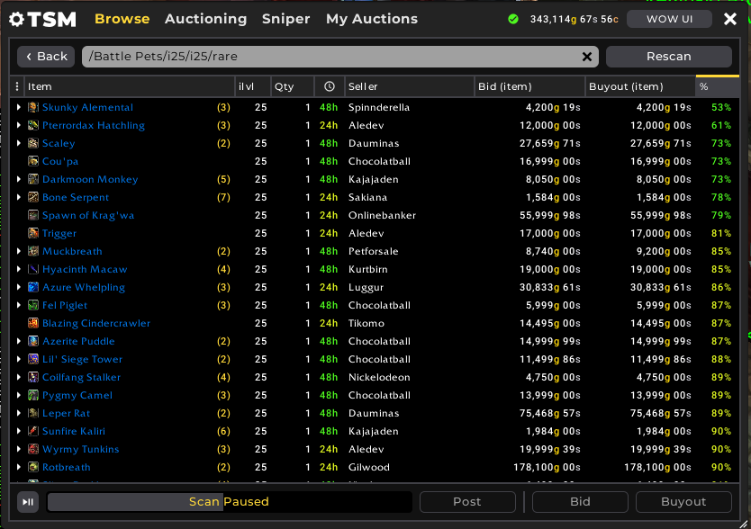
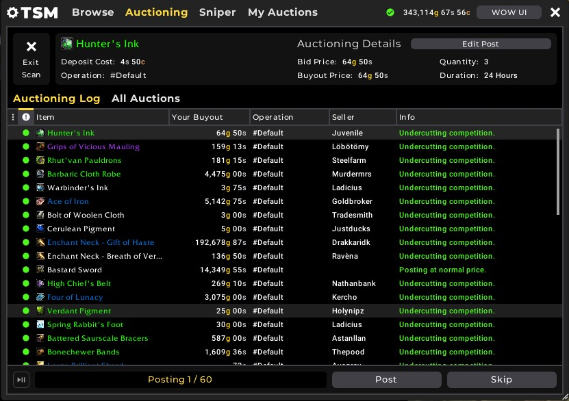
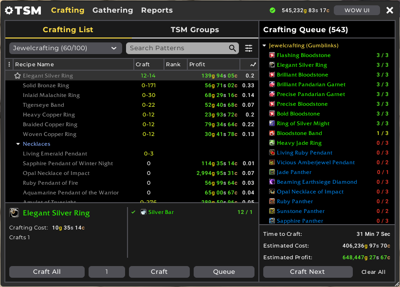
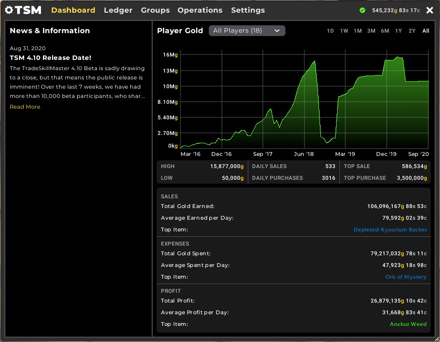
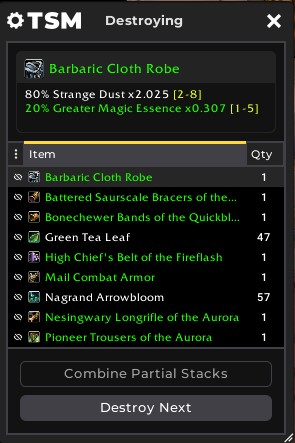
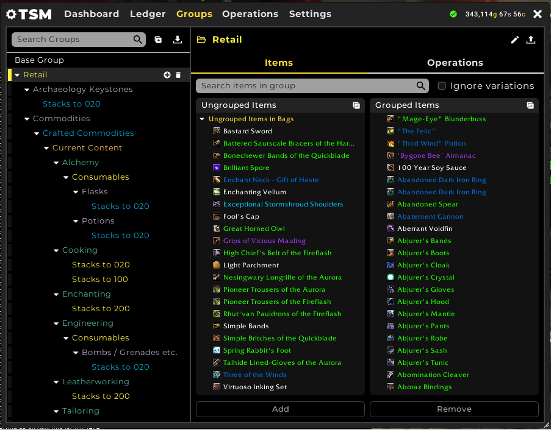
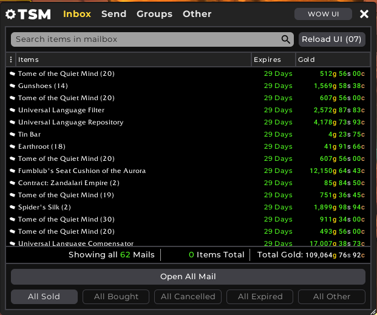

<p align="center">
  <b><span style="color:red">⚠ WARNING: This addon is in BETA — may contain bugs and incomplete features ⚠</span></b>
</p>

<br>

<p align="center">
  
  
  
</p>

<h1 align="center">TradeSkillMaster — WotLK 3.3.5a backport</h1>

<p align="center">
  <b>The complete TradeSkillMaster suite for World of Warcraft 3.3.5a (WotLK).</b><br>
  <i>Backport of TradeSkillMaster v4.14.66 to the WoW 3.3.5a client.</i>
</p>

<p align="center">
  <a href="#english">English</a> ·
  <a href="#russian">Русский</a>
</p>

---

<a name="english"></a>
## English

<p align="center">
  <a href="#modules">Modules</a> ·
  <a href="#installation">Installation</a> ·
  <a href="#credits">Credits</a>
</p>

### About

**TradeSkillMaster (TSM)** is an all-in-one suite for the in-game economy:
auction house scanning, bulk posting, crafting management, mailing, group-based
automation, and more. This repository is a **backport of TSM v4.14.66**
to the **WoW 3.3.5a (WotLK)** client.

<a name="modules"></a>
### Modules

#### Auction House



The central hub for everything auction-related. Scan the entire auction house,
browse current listings, and search for specific items or whole groups. Both a
fast full-scan and targeted searches are built right into the AH window.

#### Auctioning



Bulk-post your items for sale. A single Post Scan walks through your groups,
applies your auctioning operations (pricing, undercut, stack size, duration),
and posts everything for you — no more posting auctions one by one.

#### Crafting



Manage your professions and crafting queue. Track recipes and reagents, queue
up what you want to make, and see the expected crafting profit so you always
know which crafts are worth selling.

#### Dashboard



The main overview screen. At-a-glance summaries and charts of your activity —
gold, sales, and the key numbers you care about, all in one place.

#### Destroying



Disenchant, mill, and prospect items in bulk. Set up groups and operations and
let TSM process stacks of materials quickly instead of doing it by hand.

#### Groups



The heart of TSM. Organize your items into groups and attach operations
(auctioning, shopping, crafting, mailing, etc.) so every other module knows
exactly how to treat each item.

#### Mailing



Send and collect mail in bulk. Move items and gold between your characters
based on your groups, and empty your mailbox with a single click.

<a name="installation"></a>
### Installation

1. Download the latest release (or clone this repository).
2. Extract the archive.
3. **Important:** make sure the addon folder is named exactly **`TradeSkillMaster`**
   (GitHub ZIPs extract with a `-master` suffix — rename it).
4. Move the `TradeSkillMaster` folder into:
   ```
   \Interface\AddOns\
   ```
5. Also install the **`!!!ClassicAPI`** addon into `\Interface\AddOns\` (required).
   - Download: [classicapi-1.20.zip](https://gitlab.com/Tsoukie/classicapi/-/archive/1.20/classicapi-1.20.zip)
6. Enable both on the character-select AddOns screen and launch the game. Type `/tsm` to open.

### Compatibility

- Built and tested on **WoW 3.3.5a** (Interface `30300`).
- Should work on any WotLK 3.3.5a private server (developed on Warmane).

<a name="credits"></a>
### Credits

- Original addon: **TradeSkillMaster Team**
- WotLK 3.3.5a backport: **Keoo**
- Required polyfill: **!!!ClassicAPI**

---

<a name="russian"></a>
## Русский

<p align="center">
  <a href="#модули">Модули</a> ·
  <a href="#установка">Установка</a> ·
  <a href="#благодарности">Благодарности</a>
</p>

### Об аддоне

**TradeSkillMaster (TSM)** — это комплексный набор инструментов для внутриигровой
экономики: сканирование аукциона, массовое выставление лотов, управление
профессиями, рассылка почты, автоматизация на основе групп и многое другое.
Этот репозиторий — **бэкпорт TSM v4.14.66** под клиент
**WoW 3.3.5a (WotLK)**.

<a name="модули"></a>
### Модули

#### Аукцион (Auction House)


Главный центр всего, что связано с аукционом. Сканируйте весь аукцион,
просматривайте текущие лоты и ищите конкретные предметы или целые группы.
Быстрое полное сканирование и точечный поиск встроены прямо в окно аукциона.

#### Выставление лотов (Auctioning)


Массовое выставление предметов на продажу. Одно сканирование (Post Scan)
проходит по вашим группам, применяет операции аукциониста (цена, undercut,
размер стака, длительность) и выставляет всё за вас — больше не нужно постить
лоты по одному.

#### Крафт (Crafting)


Управление профессиями и очередью крафта. Отслеживайте рецепты и реагенты,
ставьте в очередь то, что хотите создать, и видьте ожидаемую прибыль от крафта —
вы всегда знаете, что выгодно делать на продажу.

#### Панель (Dashboard)


Главный обзорный экран. Сводки и графики вашей активности с первого взгляда —
золото, продажи и ключевые показатели в одном месте.

#### Распыление (Destroying)


Массовое распыление, размол и огранка предметов. Настройте группы и операции —
и TSM быстро обработает стаки материалов вместо ручной работы.

#### Группы (Groups)


Сердце TSM. Организуйте предметы в группы и привязывайте к ним операции
(аукцион, закупка, крафт, почта и т.д.), чтобы каждый модуль точно знал, как
обращаться с каждым предметом.

#### Почта (Mailing)


Массовая отправка и сбор почты. Перемещайте предметы и золото между своими
персонажами на основе групп и опустошайте почтовый ящик одним кликом.

<a name="установка"></a>
### Установка

1. Скачайте последний релиз (или клонируйте репозиторий).
2. Распакуйте архив.
3. **Важно:** папка аддона должна называться ровно **`TradeSkillMaster`**
   (GitHub ZIP распаковывается с суффиксом `-master` — переименуйте).
4. Переместите папку `TradeSkillMaster` в:
   ```
   \Interface\AddOns\
   ```
5. Также установите аддон **`!!!ClassicAPI`** в `\Interface\AddOns\` (обязательно).
   - Скачать: [classicapi-1.20.zip](https://gitlab.com/Tsoukie/classicapi/-/archive/1.20/classicapi-1.20.zip)
6. Включите оба на экране выбора персонажа и запустите игру. Введите `/tsm`, чтобы открыть.

### Совместимость

- Собрано и протестировано на **WoW 3.3.5a** (Interface `30300`).
- Должно работать на любом WotLK 3.3.5a приватном сервере (разработка велась на Warmane).

<a name="благодарности"></a>
### Благодарности

- Оригинальный аддон: **Команда TradeSkillMaster**
- Бэкпорт под WotLK 3.3.5a: **Keoo**
- Обязательный полифилл: **!!!ClassicAPI**
